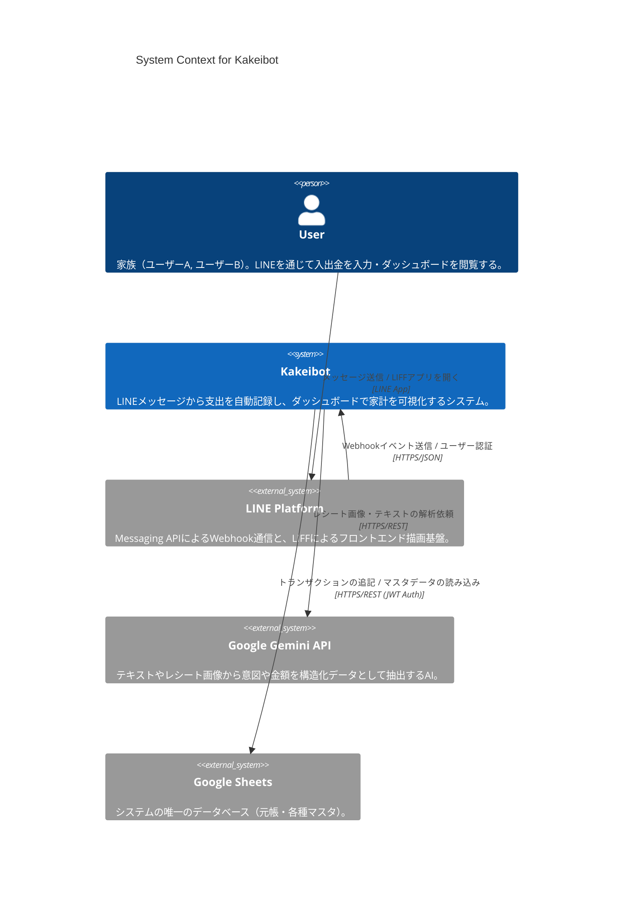
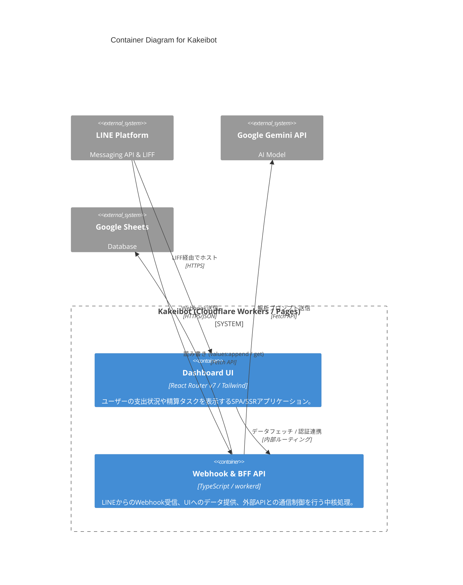
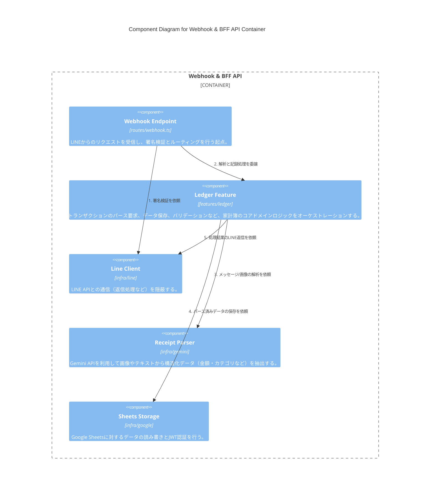

# C4モデル

## レベル1: System Context (システムコンテキスト)
Kakeibot とユーザー、および外部システムとの全体的な関係性を示します。

## レベル2: Container (コンテナ)
Cloudflare Workers 上で稼働する Kakeibot 内部の論理的なコンテナ構成を示します。

## レベル3: Component (コンポーネント)
「Webhook & BFF API」コンテナ内部で具体的に連携する機能モジュール同士のフローを表現しています。

